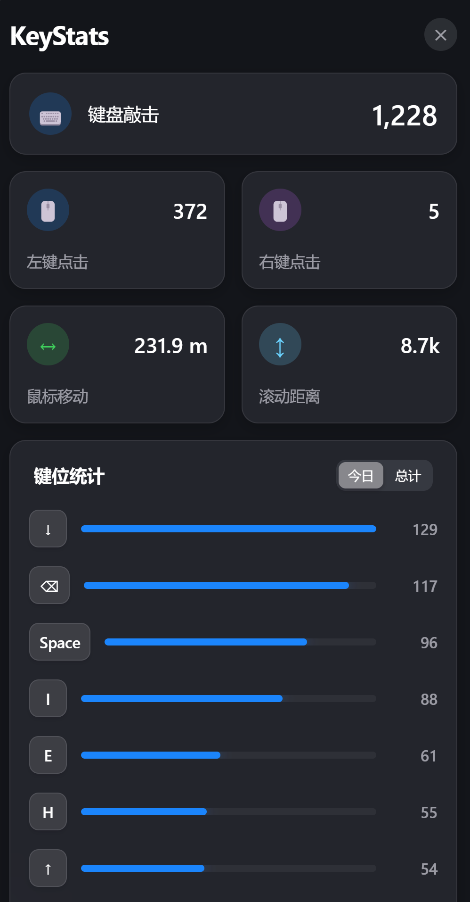

# ⌨️ KeyStats - Windows 键鼠统计工具


<p align="center">
  <strong>🎯 追踪你的键盘和鼠标使用习惯 | 本地存储 | 隐私友好</strong>
</p>

<p align="center">
  
  
  
  
  
  
</p>

---

## 📖 简介

**KeyStats** 是一款专为 Windows 打造的轻量级系统托盘工具，能够全方位统计您的键盘和鼠标使用习惯。它采用现代化的风格设计，拥有精美的深色毛玻璃交互界面，让数据统计也能赏心悦目。

> 💡 **特点**: 启动后程序会静默运行在系统托盘中，点击托盘图标即可唤起统计面板。所有数据仅存储在本地，绝不上传，完全保护您的隐私。

---

## 🖼️ 界面预览




---

## ✨ 核心功能

### 🚀 全方位统计
- **键盘敲击**：记录全天按键总次数。
- **组合键识别**：精准识别并统计如 `Ctrl + C`、`Win + V` 等快捷键操作。
- **鼠标点击**：分别统计鼠标左键、右键点击频率。
- **移动轨迹**：统计鼠标在屏幕上划过的累计物理距离（米/公里）。
- **滚轮里程**：记录滚轮滚动的累计行数/像素。

### 📊 数据可视化
- **常用键位排行榜**：展示今日及总计前 15 名最常用的按键（支持特殊功能键映射）。
- **历史趋势分析**：
    - 支持 **7 天** 和 **30 天** 时间跨度切换。
    - 指标切换：可查看键盘、点击、移动、滚轮的单项历史趋势。
    - 图表切换：支持 **折线图** 与 **柱状图** 实时转换。
- **实时同步**：每秒自动刷新统计数据。

### 🎨 极致 UI/UX
- **深色毛玻璃**:半透明磨砂质感，完美契合现代 Windows 桌面。
- **智能定位**：面板根据托盘位置自动弹出在任务栏上方。
- **静默运行**：无任务栏图标，不干扰正常工作。
- **单实例运行**：自动锁定，防止多个程序同时启动产生冲突。

### ⚙️ 实用特性
- **本地化存储**：数据仅保存在本地（`electron-store`），绝不上传，保护隐私。
- **开机自启动**：面板内一键开关，无需繁琐设置。
- **轻量资源占用**：优化输入钩子，极低 CPU 占用。

---

## 🛠️ 技术栈

- **Runtime**: [Electron 29](https://www.electronjs.org/)
- **Frontend**: [Vue 3](https://vuejs.org/) + [TypeScript](https://www.typescriptlang.org/)
- **Build**: [electron-vite](https://electron-vite.org/) + [Vite 5](https://vitejs.dev/)
- **Charts**: [Apache ECharts 5](https://echarts.apache.org/)
- **Input Hook**: [uiohook-napi](https://github.com/T09/uiohook-napi) (全局原生输入钩子)
- **Storage**: [electron-store](https://github.com/sindresorhus/electron-store) (本地 JSON 存储)
- **Styling**: SCSS + 亚克力透明效果

---

## 📥 安装与运行（超详细小白教程）

本教程假设您从未接触过 Node.js 开发环境，将一步一步带您完成安装。

---

### 📋 第一步：安装 Node.js

Node.js 是运行本项目的必备环境。

1. **下载 Node.js**
   - 访问官网: https://nodejs.org/zh-cn/
   - 下载 **LTS (长期支持版)** - 推荐选择 **v18.x** 或 **v20.x**
   - 选择 Windows 安装包 (`.msi` 格式)

2. **安装 Node.js**
   - 双击下载的 `.msi` 文件
   - 一路点击 "Next"
   - ⚠️ **重要**: 在安装选项中，请勾选 **"Automatically install the necessary tools"** (自动安装必要工具)
   - 完成安装

3. **验证安装**
   - 按 `Win + R`，输入 `cmd`，回车打开命令提示符
   - 输入以下命令，回车：
     ```bash
     node --version
     ```
   - 如果显示类似 `v20.10.0` 的版本号，说明安装成功 ✅

---

### 📋 第二步：安装 C++ 编译工具（关键步骤！）

本项目使用了 `uiohook-napi` 原生模块，它需要 C++ 编译环境才能正常安装。

> ⚠️ **如果跳过此步骤，`npm install` 会报错！**

**方法一：通过 Visual Studio Build Tools (推荐)**

1. 访问下载页面: https://visualstudio.microsoft.com/visual-cpp-build-tools/
2. 点击 **"Download Build Tools"** 下载安装器
3. 运行安装器，选择 **"Desktop development with C++"** (使用 C++ 的桌面开发)
4. 点击右下角 **"Install"**，等待安装完成（约 2-6 GB）

**方法二：通过命令行安装 (简单但较慢)**

以**管理员身份**运行命令提示符 (右键 cmd -> 以管理员身份运行)：

```bash
npm install --global windows-build-tools
```

等待安装完成（可能需要 10-30 分钟）。

---

### 📋 第三步：下载项目代码

**方式 A：使用 Git 克隆 (推荐)**

```bash
# 如果没有 Git，可以先安装: https://git-scm.com/downloads
git clone https://github.com/your-repo/KeyStats.git
cd KeyStats
```

**方式 B：直接下载 ZIP**

1. 在 GitHub 页面点击绿色的 **"Code"** 按钮
2. 选择 **"Download ZIP"**
3. 解压到任意目录
4. 打开命令提示符，切换到解压目录：
   ```bash
   cd C:\Users\你的用户名\Downloads\KeyStats-main
   ```

---

### 📋 第四步：安装项目依赖

在项目目录下运行：

```bash
npm install
```

> ⏰ 首次安装可能需要 2-5 分钟，请耐心等待。
> 
> 如果看到类似 `node-gyp rebuild` 的输出，说明正在编译原生模块，这是正常的。

**如果安装失败**，请检查：
- 是否已完成第二步（C++ 编译工具）
- 尝试清除缓存后重试：
  ```bash
  npm cache clean --force
  npm install
  ```

---

### 🚀 第五步：启动应用

#### 方式一：开发模式（推荐调试时使用）

```bash
npm run dev
```

此模式下会打开开发者工具，方便查看日志和调试。

#### 方式二：静默启动（日常使用推荐）

```bash
npm run build
```

然后双击项目目录下的 `Start.vbs` 文件，程序将静默启动，无黑色控制台窗口。

> 💡 启动后请查看屏幕右下角系统托盘区域，可能需要点击 **"显示隐藏的图标"** (向上箭头) 才能看到 KeyStats 图标。

---

### 📦 第六步：打包成独立 EXE（可选）

如果您想分享给朋友使用，可以打包成便携版 EXE：

```bash
npm run dist
```

打包完成后，可执行文件位于 `release/` 目录下，文件名为 `KeyStats.exe`。

---

### 📝 命令速查表

| 命令 | 作用 |
|------|------|
| `npm install` | 安装项目依赖 |
| `npm run dev` | 开发模式启动（带调试窗口） |
| `npm run build` | 构建生产版本代码 |
| `npm run dist` | 打包成可执行文件 (.exe) |
| `npm run preview` | 预览构建结果 |

---

## 🎮 使用指南

### 打开面板
- **单击**系统托盘中的 KeyStats 图标即可打开统计面板

### 面板功能说明

| 区域 | 功能 |
|------|------|
| **键盘敲击** | 显示今日键盘按键总次数 |
| **左键/右键点击** | 分别统计鼠标左键和右键的点击次数 |
| **鼠标移动** | 鼠标在屏幕上移动的累计距离（自动换算为米/公里） |
| **滚动距离** | 鼠标滚轮滚动的累计量 |
| **键位统计** | 显示最常用的 15 个按键，支持 [今日] / [总计] 切换 |
| **历史趋势** | 可视化展示历史数据，支持 7天/30天、多指标、折线/柱状图切换 |
| **开机启动** | 勾选后 Windows 启动时自动运行 KeyStats |
| **重置** | 清除今日统计数据（不影响历史数据） |
| **退出** | 完全退出程序 |

### 隐藏面板
- 点击面板右上角的 **✕** 按钮
- 或点击面板外的任意区域

> 💡 **提示**: 隐藏面板不会停止统计，程序继续在后台运行。

### 托盘菜单
右键点击托盘图标可打开菜单：
- **显示面板** - 打开统计面板
- **重置统计** - 清除今日数据
- **开机启动** - 开关 Windows 自启动
- **退出应用** - 完全退出程序

---

## 📂 项目结构

```text
KeyStats/
├── src/
│   ├── main/            # Electron 主进程 (托盘管理、IPC、输入监听)
│   ├── preload/         # 预加载脚本 (window.api 桥接)
│   └── renderer/        # Vue 渲染进程 (UI 组件、ECharts、SCSS 样式)
├── resources/           # 图标资源与原始素材
├── Start.vbs            # 静默启动脚本 (无黑框控制台)
├── UpdateAndRestart.bat # 自动更新与重启脚本 (维护用)
└── package.json         # 项目配置与依赖说明
```

---

## 📝 数据存储说明

本项目所有数据均保存在本地，默认不进行任何网络传输。
- **配置文件路径**: `%APPDATA%/KeyStats/keystats-data.json`
- **存储内容**:
    - `today`: 今日详细统计数据
    - `history`: 过去 30 天的历史记录
    - `keyStats`: 今日按键频率统计
    - `totalKeyStats`: 累计按键频率统计

---

## ❓ 常见问题 (FAQ)

### 🔸 Q: 启动后没有任何反应？

**A**: KeyStats 启动后默认**隐藏在系统托盘**中，不会弹出窗口。请按以下步骤查找：

1. 看向屏幕右下角（时钟附近）
2. 点击 **向上的小箭头** (显示隐藏的图标)
3. 找到 KeyStats 的 **笑脸图标** 😊
4. 单击图标即可打开面板

---

### 🔸 Q: `npm install` 安装失败？

**A**: 这通常是因为缺少 C++ 编译环境。请检查：

1. **确认已安装 Visual Studio Build Tools**
   - 参考上方 "第二步：安装 C++ 编译工具"
   
2. **检查 Node.js 版本**
   ```bash
   node --version  # 应该是 v18.x 或更高
   ```

3. **清除缓存重试**
   ```bash
   npm cache clean --force
   rd /s /q node_modules
   del package-lock.json
   npm install
   ```

4. **常见错误信息对照表**
   
   | 错误信息 | 原因 | 解决方案 |
   |---------|------|----------|
   | `node-gyp rebuild failed` | 缺少 C++ 编译工具 | 安装 Visual Studio Build Tools |
   | `EACCES permission denied` | 权限不足 | 以管理员身份运行 |
   | `ENOENT` | 路径包含中文或特殊字符 | 将项目放到英文路径下 |

---

### 🔸 Q: 窗口背景是黑色的，没有毛玻璃效果？

**A**: 这是 Windows 透明效果兼容性问题：

1. **检查系统设置**
   - 打开 "设置" -> "个性化" -> "颜色"
   - 确保 **"透明效果"** 已开启

2. **更新显卡驱动**
   - 部分旧版显卡驱动不支持透明窗口

3. **操作系统**
   - 毛玻璃效果在 **Windows 11** 上表现最佳
   - Windows 10 部分版本可能有兼容性问题

---

### 🔸 Q: 安全软件提示"键盘记录器"风险？

**A**: 是的，这是**正常现象**。

- KeyStats 需要使用全局键盘/鼠标钩子来统计输入
- 这与恶意键盘记录器使用的技术相同，因此会触发安全警报
- 但本项目是**完全开源**的，代码透明可审查
- 所有数据**仅保存在本地**，不会上传到任何服务器

**解决方案**: 将 KeyStats 添加到安全软件的白名单中。

---

### 🔸 Q: 如何重置统计数据？

**A**: 有两种方式：

1. **重置今日数据**: 在面板底部点击 **"重置"** 按钮
2. **完全清除所有数据**: 删除配置文件
   ```
   %APPDATA%\KeyStats\
   ```
   在文件资源管理器地址栏输入上述路径，删除整个文件夹。

---

### 🔸 Q: 如何设置开机自启动？

**A**: 在 KeyStats 面板左下角，勾选 **"开机启动"** 即可。

---

### 🔸 Q: 如何彻底退出程序？

**A**: 有两种方式：

1. 在面板底部点击 **"退出"** 按钮
2. 右键托盘图标，选择 **"退出应用"**

> ⚠️ 注意：点击面板右上角的 ✕ 只会**隐藏窗口**，程序仍在后台运行。

---

### 🔸 Q: 统计数据保存在哪里？

**A**: 数据保存在：
```
%APPDATA%\KeyStats\keystats-data.json
```

您可以备份此文件以保留历史数据。

---

## 📜 开源协议

基于 [MIT License](LICENSE) 开源 - 您可以自由使用、修改和分发本软件。

---

## 🤝 贡献指南

欢迎提交 Issue 和 Pull Request！

1. Fork 本仓库
2. 创建功能分支: `git checkout -b feature/AmazingFeature`
3. 提交更改: `git commit -m 'Add some AmazingFeature'`
4. 推送分支: `git push origin feature/AmazingFeature`
5. 提交 Pull Request

---

## 🙏 致谢

- [Electron](https://www.electronjs.org/) - 跨平台桌面应用框架
- [Vue 3](https://vuejs.org/) - 渐进式 JavaScript 框架
- [ECharts](https://echarts.apache.org/) - 强大的可视化图表库
- [uiohook-napi](https://github.com/T09/uiohook-napi) - 跨平台输入钩子库
- [electron-store](https://github.com/sindresorhus/electron-store) - 简洁的本地存储方案

---

## 🌟 觉得好用？

如果这个项目帮到了您，欢迎给一个 **Star** ⭐️，这是对我最大的鼓励！

---

<p align="center">
  <sub>Made with ❤️ for productivity enthusiasts</sub>
</p>

<p align="center">
  <sub>© 2024-2026 KeyStats | 键鼠统计工具</sub>
</p>
